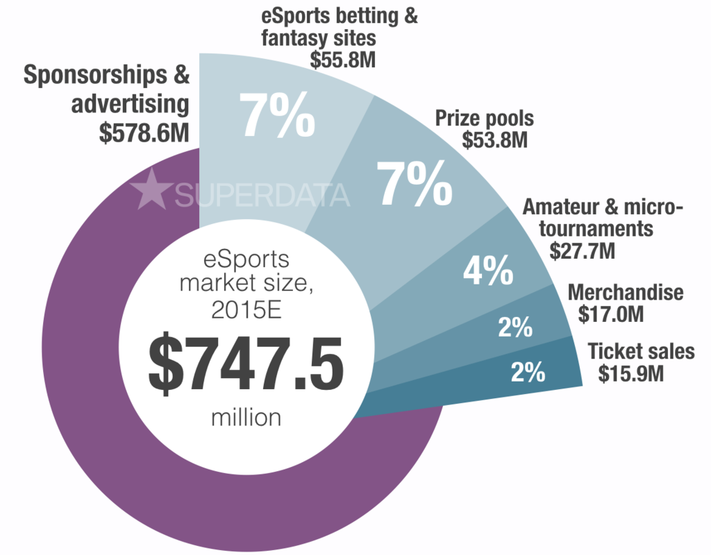
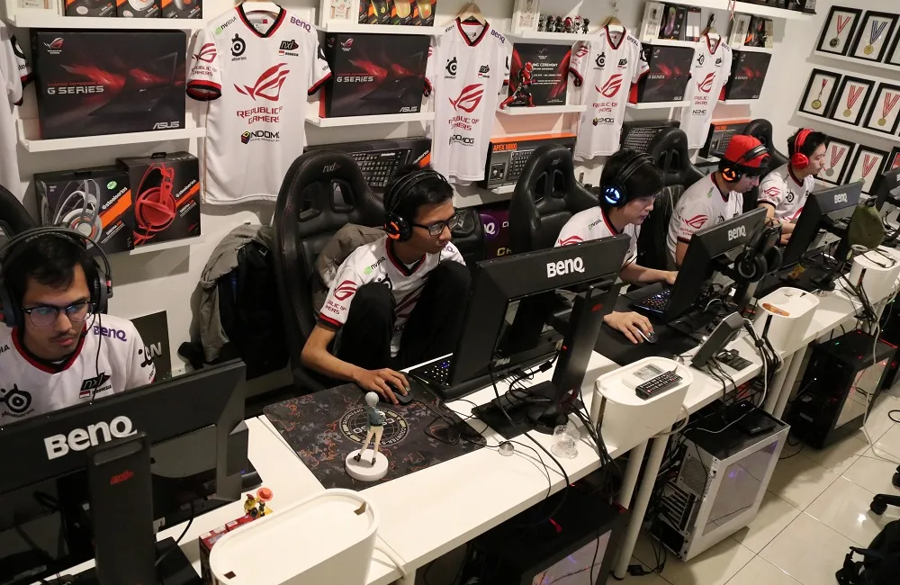
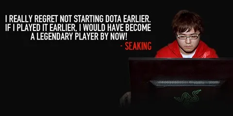
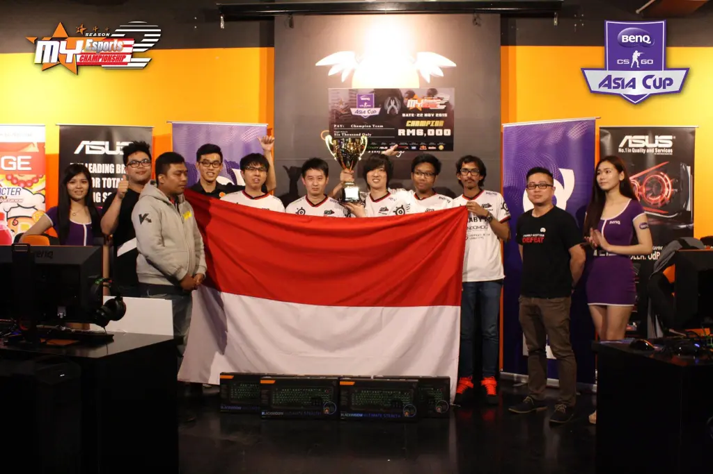

Siapakah gamer yang tidak mengenal istilah Elektronik Sports, atau yang lebih dikenal dengan eSports? Menurut Fortune, SuperData Research, perusahaan asal Amerika, memprediksi bawah eSports akan meraup pendapatan sebesar 1.8 milyar dollar Amerika dua tahun mendatang.

Tahun 2015 kemarin, eSports telah berhasil meraup pendapatan sebesar US$ 748 juta, dimana Asia menguasai pasar dengan pendapatan  321 juta dollar Amerika, disusul Amerika Utara dengan pendapatan 224 juta dollar Amerika, Eropa sebesar  172 juta dollar Amerika, dan sisanya dari berbagai penjuru dunia sebesar 29 juta dollar Amerika.

Peningkatan ini berhasil tercapai karena banyaknya perusahaan besar yang melihat eSports sebagai industri yang cukup menguntungkan. Bahkan produsen minuman sekalipun seperti Coca-Cola dan Redbull menyiapkan dana khusus untuk memasarkan produk mereka melalui eSports. Tak hanya itu, ESPN, sebuah stasiun televisi olahraga internasional, kini memiliki program acara khusus untuk eSports.

Selama dua tahun terakhir ini, dunia eSports terus mengalami perkembangan begitu pesat. Jumlah penonton untuk setiap pertandingan terus meningkat hingga menembus jutaan penonton. eSports sendiri memiliki cabang layaknya olahraga tradisional – mulai dari game bergenre FPS (First Person Shooter), MOBA (Multiplayer Online Battle Arena), Fighting, hingga permainan kartu yang mirip permainan Yu-Gi-Oh!.

Saat ini, genre yang paling banyak diminati oleh para pemain di seluruh dunia adalah MOBA, seperti DOTA 2 dan League of Legends. Sedangkan untuk FPS, Counter Strike: Global Offensive masih menjadi favorit untuk para gamer di seluruh dunia.

DOTA 2 memegang rekor hadiah eSports terbesar dengan nominal US$ 18,429,613 atau setara dengan Rp 241 milyar. Uniknya, total hadiah tersebut tidak sepenuhnya disiapkan oleh Valve sebagai penyelenggara tournament, namun juga dari mekanisme crowdfunding para gamer di seluruh dunia.

Para pemain DOTA 2 yang membeli Compendium turut menyumbangkan sekian persen dari harga Compendium untuk ditambahkan ke total hadiah yang awalnya disediakan Valve sebesar US$ 1,600,000.

### Why?

Salah satu alasan utama para gamer untuk menjadi atlit eSports adalah hadiah yang bisa dimenangkan dari turnamen. Bayangkan saja, Anda bisa bawa pulang uang Rp 60 milyar dalam waktu 3 hari – dengan catatan, Anda bisa mengalahkan semua tim-tim terbaik dari seluruh dunia. Tentunya hal ini sangat menggiurkan bukan?

Dengan terjun ke dunia eSports, Anda tidak hanya akan sekedar bermain game. Namun, Anda juga bisa mencari nafkah dari dunia eSports karena selain membawa pulang hadiah turnamen, Anda juga bisa digaji layaknya pegawai kantoran.

Selain keuntungan materiil, menjadi seorang Pro Gamer juga menawarkan pengalaman yang belum tentu didapatkan oleh gamers biasa seperti kebanggaan mewakili Indonesia melawan tim-tim gaming lain dari seluruh dunia, jalan-jalan ke berbagai negara untuk menghadiri event game, bertemu dan berbagi cerita dengan Pro Gamer lainnya yang bahkan berasal dari negara yang berbeda, ataupun bahkan bisa juga menjadi brand ambassador untuk sebuah produk gaming.

Sayangnya, faktanya, menjadi seorang Pro Gamer bukanlah persoalan mudah. Selain harus mengasah skill selama ribuan jam, Anda juga harus punya mental yang kuat, rasa tanggung jawab yang besar, dan motivasi diri untuk terus berkembang.

Namun demikian, semua proses berat yang harus Anda jalani untuk menjadi atlit eSports berprestasi tidak akan berakhir dengan sia-sia kalaupun Anda belum berprestasi di kancah nasional ataupun internasional, karena proses-proses tadi juga akan membangun karakter Anda untuk jadi lebih baik dan mengasah mental Anda agar lebih teruji.
